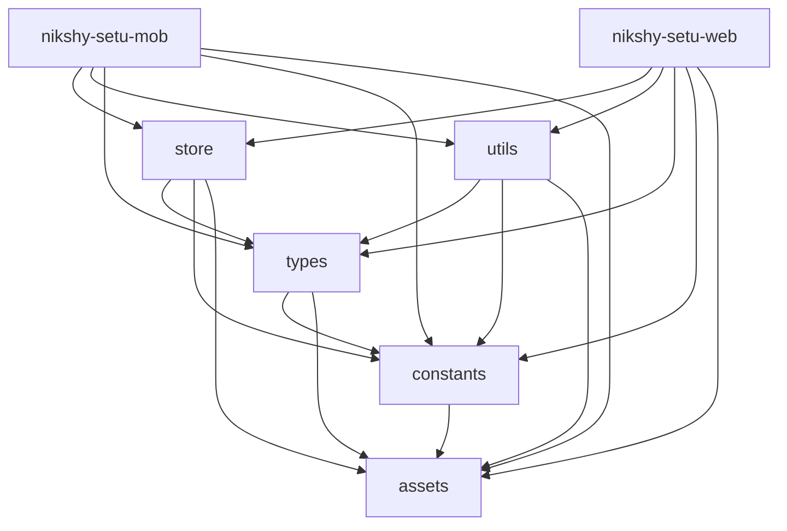

<p align="center">
  <a href="https://nikshay-setu.in" target="_blank">
  
  </a>
</p>

<p align="center">
  <a href="https://nikshay-setu.in/" target="_blank">
    
  </a>
</p>

<div align="center">


</div>

## Ni-kshay Setu | Support to End Tuberculosis

The Ni-kshay Setu app ([https://nikshay-setu.in/](https://nikshay-setu.in/)), already with **44K+ subscribers**, empowers healthcare providers to make informed decisions and contributes to India's mission to combat tuberculosis. Available on [web](https://nikshay-setu.in/), [Android](https://play.google.com/store/apps/details?id=com.iiphg.tbapp&pli=1), and [iOS](https://apps.apple.com/in/app/ni-kshay-setu/id1631331386) platforms in 8 languages, it offers real-time updates, interactive modules, and personalized insights, revolutionizing TB knowledge management and accessibility across India.

## Table of Contents

- [Introduction](#introduction)
- [Features](#features)
- [Tech Stack](#tech-stack)
- [Setup Instructions](#setup-instructions)
  - [Install Node version v20](#install-node-version-v20)
  - [Installation](#installation)
    - [Clone the repository](#installation)
    - [Install dependencies](#installation)
    - [Set up environment variables](#installation)
    - [Run development Android/iOS](#installation)
    - [Run development Web](#installation)
    - [Build Android AAB](#installation)
    - [Build Android project](#installation)
    - [Build Web project](#installation)
- [Conventional Branching](#conventional-branching)
- [Conventional Commits](#conventional-commits)
- [Folder Structure](#folder-structure)
  - [Apps](#apps)
  - [Shared Folders](#shared-folders)
  - [Dependency Graph](#dependency-graph)
- [Third-Party Documentation](#third-party-documentation)
- [Links](#links)
- [License](#license)

## Introduction

Ni-Kshay SETU is a groundbreaking digital solution available as a web application, Android application, and iOS application. With a mission to support healthcare providers in decision-making and transform knowledge into empowerment, this innovative and interactive learning tool is a catalyst in India's journey towards a TB-free nation. As a comprehensive digital platform, Ni-Kshay SETU revolutionizes the way healthcare providers approach TB management. By leveraging cutting-edge technology, it empowers medical professionals with real-time support and evidence-based recommendations, ensuring they have the most up-to-date information at their fingertips. With an intuitive interface and user-friendly design, Ni-Kshay SETU offers a seamless experience across devices, making it accessible to a wide range of users. The web application allows healthcare providers to access the platform from any computer, while the Android and iOS applications provide mobility and convenience for on-the-go professionals. Through a range of interactive modules, virtual simulations, and case studies, Ni-Kshay SETU transforms learning into a dynamic and engaging experience. Healthcare providers can enhance their knowledge and skills by practicing TB case management in a risk-free environment. They can diagnose, prescribe treatment plans, and monitor patient progress, gaining invaluable experience and building their confidence in TB management.

> The Ni-Kshay SETU app is part of the 'Closing the Gaps in TB care Cascade (CGC)' project, developed by the Indian Institute of Public Health, Gandhinagar (https://iiphg.edu.in/). This project aims to strengthen health systems' ability to comprehensively monitor and respond to the TB care cascade with quality improvement (QI) interventions. This digital solution is one of the key interventions of the project with the objectives to strengthen the knowledge support system of the health staff in TB patient-centric care and program management of the National TB Elimination Program.

> IIPHG, The Union, and NTEP are proud partners in the development and implementation of Ni-Kshay SETU.

> Technological support for this project is provided by Digiflux Technologies Pvt. Ltd. (https://www.digiflux.io), contributing to the development and implementation of the digital solution.

## Features

- **Subscriber Monitoring:** Keep track of Ni-Kshay SETU subscribers' progress and activities.
- **Data Visualization:** Visualize data in a user-friendly way for easy analysis, making it simpler to understand complex information.
- **Module Management:** Create and manage various modules, including Diagnosis, Treatment, and other types of content to tailor the platform to your needs.
- **Assessment Creation:** Develop and manage assessments for all subscribers or specific groups, allowing for better evaluation and customization. This can also be done at each state/district levels for their respective programs.
- **Material and Document Management:** Organize and provide access to materials and documents for subscribers, ensuring they have the necessary resources.
- **Leaderboard Progress:** Monitor subscribers' progress using leaderboard parameters, encouraging healthy competition and motivation.
- **Notification System:** Implement a notification system to alert and remind subscribers about important information and activities.
- **Roles and Permissions:** Manage roles and permissions for State and District level administrators to maintain control and security.
- **Master Data Management:** Oversee master data such as states, districts, health facilities, and cadres to ensure accuracy and consistency in the system.
- **Automatic News Feed:** Incorporate an automated news feed from various sources, keeping subscribers informed and updated on relevant news and developments.
- **Central Government Applications:** Add relevant applications related to government programs, enhancing the platform's utility and functionality.
- **Multilingual Support:** Control and manage multiple language support directly from the admin panel, making it easier to serve a diverse user base.
- **Chatbot and Machine Learning:** Manage and control the chatbot, machine learning, and data modeling features, offering users an interactive and intelligent experience within the platform.
- **Managing Health Facilities for T.B. :** Efficiently manage healthcare facilities within the platform, complete with configurable locations (State, District, Village, City including Latitude Longitude) and details about the services available at each location.
- **KBase:** Provides cadre-specific learning content.
- **Knowledge Quiz:** Offers proactive and planned assessments based on user activity.
- **Query2CoE:** Enables users to raise queries related to TB treatment protocols and ensures timely responses through a structured ticketing system.
- **Screening Tool:** Assists in early identification of potential TB cases.

## Tech Stack

- **Frontend:** React, Redux, TypeScript, React Native
- **Backend:** Node.js, Express, MongoDB
- **Authentication:** NextAuth.js with Google integration
- **State Management:** Redux (without @reduxjs/toolkit)
- **Testing:** Jest, React Testing Library

## Setup Instructions

### Install Node version v20

```bash
node -v
```

### Installation

1. **Clone the repository:**

```bash
git clone <repository_url>
cd <project_directory>
```

2. **Install dependencies:**

```bash
npm install
```

3. **Set up environment variables:**

Create a `.env` file in the root directory and copy values from `.env.example`.
Also add `google-services.json` and `GoogleService-Info.plist` for notifications.

4. **Run development (Android/iOS):**

```bash
npx nx run nikshy-setu-mob:start
```

5. **Run development (Web):**

```bash
npx nx run nikshy-setu-web:serve
```

6. **Build Android AAB** (To make a production build, ensure the `nikshay_setu_prod.keystore` file is present.)

```bash
npm run build-bundle
```

7. **Build Android project:**

```bash
npm run build-android
```

8. **Build Web project:**

```bash
npm run build-web
```

## Conventional Branching

- `main`: Production-ready code
- `develop`: Integration branch
- `feature/feature-name`: New features
- `bugfix/bugfix-name`: Bug fixes
- `hotfix/hotfix-name`: Urgent production fixes

## Conventional Commits

- **feat:** New feature
- **fix:** Bug fix
- **docs:** Documentation updates
- **style:** Code style changes (no logic impact)
- **refactor:** Code refactoring
- **perf:** Performance improvements
- **test:** Adding or updating tests
- **chore:** Build process or tool updates

Example:

```bash
git commit -m "feat: add new user authentication flow"
```

## Folder Structure

Monorepo using [NX Workspaces](https://nx.dev/).

### Apps

- **[nikshy-setu-mob](./apps/nikshy-setu-mob)**: React Native mobile app
- **[nikshy-setu-web](./apps/nikshy-setu-web)**: React web app

### Shared Folders

- **[store](./shared/store)**: Redux state management
- **[types](./shared/types)**: TypeScript types
- **[constants](./shared/constants)**: App constants
- **[assets](./shared/assets)**: Shared images, icons, fonts
- **[utils](./shared/utils)**: Utility functions

### Dependency Graph



## Third-Party Documentation

| No. | Service       | Description                                                                        | Documentation Link                                                   |
| --- | ------------- | ---------------------------------------------------------------------------------- | -------------------------------------------------------------------- |
| 1   | WATI          | WhatsApp messaging platform for customer communication and automation.             | [WATI API Reference](https://docs.wati.io/reference/introduction)    |
| 2   | SendGrid Mail | Email delivery service used for transactional and marketing emails.                | [SendGrid by Twilio](https://www.twilio.com/docs/sendgrid)           |
| 3   | Firebase      | Admin SDK for Firebase, used for server-side integrations like push notifications. | [firebase-admin (NPM)](https://www.npmjs.com/package/firebase-admin) |
| 4   | TextLocal     | SMS gateway used for sending text messages to users.                               | [TextLocal API Docs](https://api.textlocal.in/docs/)                 |
| 5   | NestJS        | Framework for building efficient and scalable Node.js server-side applications.    | [NestJS Official Docs](https://docs.nestjs.com/)                     |

<!-- ## Links

* [BACKEND](https://nikshay-setu.in/)
* [PYTHON](https://nikshay-setu.in/)
* [ADMIN](https://nikshay-setu.in/) -->

## License

Ni-kshay Setu project is licensed under the [GNU General Public License, Version 3.0](https://www.gnu.org/licenses/gpl-3.0).


