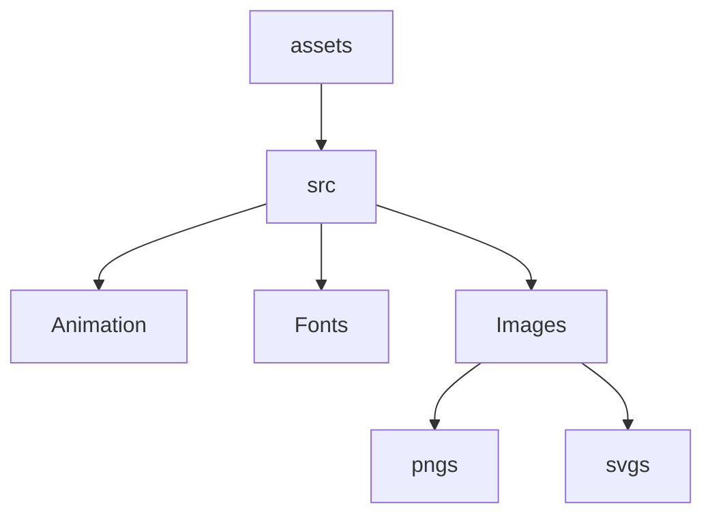

# Assets

This folder contains assets related this project, like Amimation ,fonts and Images all are used across the project. The `index.ts` file aggregates all exports for easy imports in other parts of the project.

## Dependency Graph

