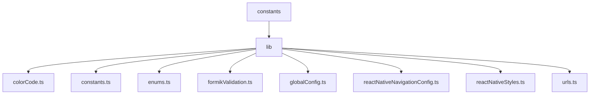

# Constants Folder

This folder contains constant values, configuration settings, and enums used across the project. The `index.ts` file aggregates all exports for easy imports in other parts of the project.

## Dependency Graph

