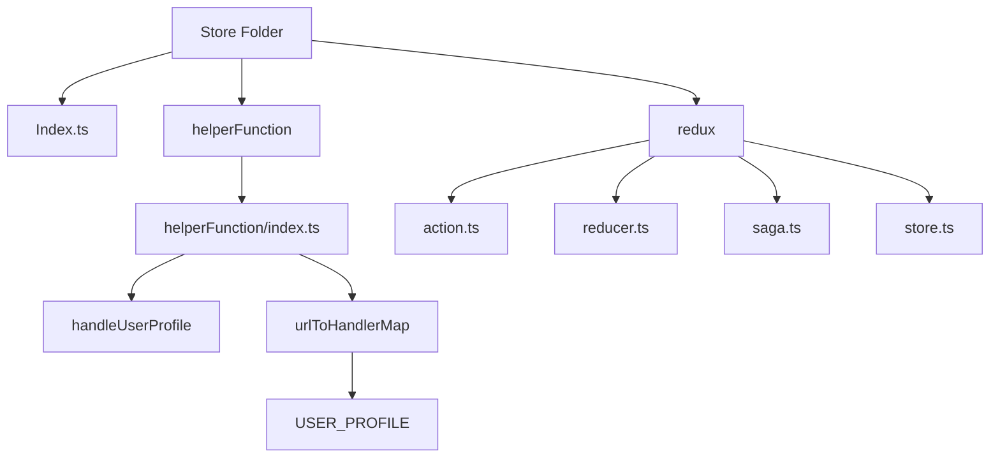

# Store

This folder contains the state management logic for the application, using Redux and related helper functions. It includes actions, reducers, sagas, and a store configuration. Additionally, it has utility functions for handling specific app logic.

## Folder Structure

- **index.ts**: The entry point for exporting store-related functionality.

- **helperFunction**: Defines various utility functions used across the application for managing state changes, particularly related to user profiles, chat history, health facility questions, and knowledge base management.

- **redux**: Contains the core Redux logic for actions, reducers, sagas, and store configuration.

- **action.ts**: Defines Redux actions to trigger state changes and communicate with the saga layer.

- **reducer.ts**: Manages the state updates based on actions dispatched.

- **saga.ts**: Handles side effects and async logic for the Redux store.

- **store.ts**: Configures the Redux store and middleware, such as Redux Saga.

## Helper Functions

The `helperFunction/index.ts` file contains utility functions that handle specific state updates. Key functions include:

- `handleUserProfile`: Manages user profile data such as name, ID, and phone number.

These functions are mapped to specific URLs and dispatched actions, allowing for a more modular approach to handling various API responses and state changes.

### URL to Handler Mapping

The `urlToHandlerMap` object provides a mapping of API endpoints to the corresponding state handlers. Key mappings include:

- `USER_PROFILE`: Updates the user profile state.

## Redux Folder

The `redux/` folder contains the core logic for Redux state management:

- **action.ts**: Defines actions that describe what changes should occur in the state.

- **reducer.ts**: The reducer receives actions and updates the state accordingly.

- **saga.ts**: Implements the logic for side effects, such as API calls or other asynchronous operations.

- **store.ts**: Configures the Redux store with middleware like Redux Saga and integrates the reducers.

## Usage

To use this folder in your project, import the necessary functions and configure the Redux store in your main application file. Make sure to connect the sagas and reducers appropriately.

```ts
import { initStore } from '@nikshay-setu-v3-monorepo/store';
import { Provider } from 'react-redux';

<Provider store={initStore()}>
  <App />
</Provider>;
```

## Dependency Graph


