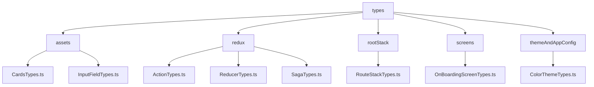

# Types Folder

This folder contains TypeScript type definitions used across the project. The `index.ts` file aggregates all type exports for easy imports in other parts of the project.

## Dependency Graph

