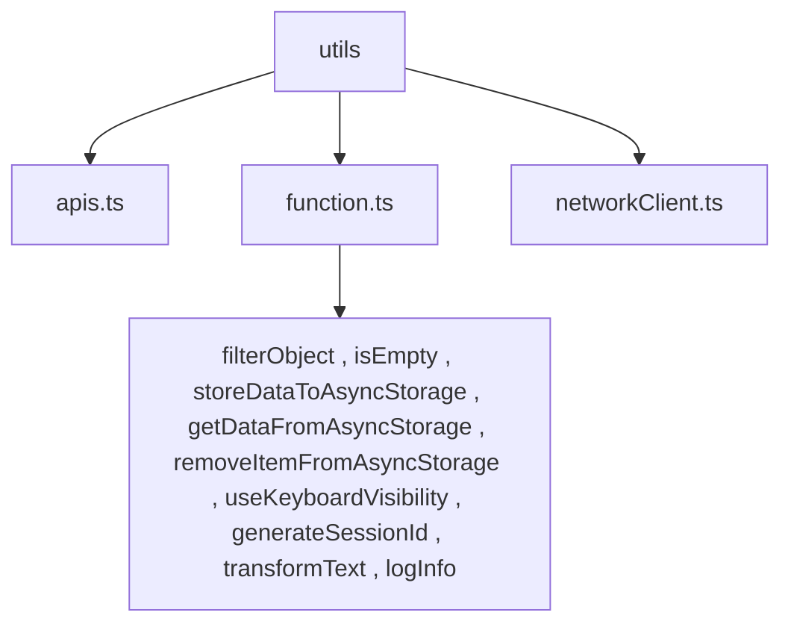

## `apis.ts`

Contains functions for calling APIs using `networkClient`. It abstracts the details of making API requests and handling responses.

## `function.ts`

Contains various utility functions:

- `filterObject`: Filters properties of an object based on certain criteria.
- `isEmpty`: Checks if a value or object is empty.
- `storeDataToAsyncStorage`: Stores data in AsyncStorage.
- `getDataFromAsyncStorage`: Retrieves data from AsyncStorage.
- `removeItemFromAsyncStorage`: Removes data from AsyncStorage.
- `useKeyboardVisibility`: Custom hook for keyboard visibility detection.
- `generateSessionId`: Generates a unique session ID.
- `transformText`: Transforms text based on specified rules.
- `logInfo`: Logs information for debugging purposes.

## `networkClient.ts`

Contains Axios requests and handling logic for making HTTP requests and processing responses.

## Dependency Graph

